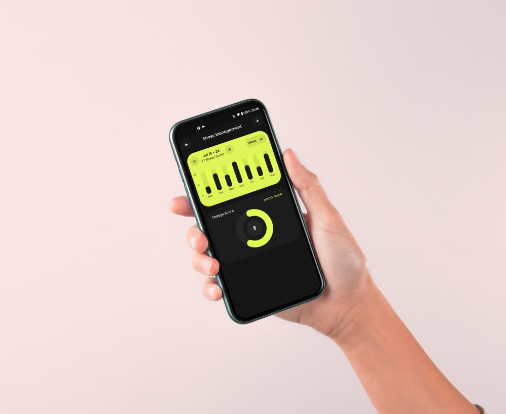

# flutter_dashboard_mockup

## Design



design credits: Zesan H. (https://www.linkedin.com/in/zesan/)

## Run on a device

1. open the project in docker container (using vscode)

2. the run

```sh
flutter pub get
flutter run
```